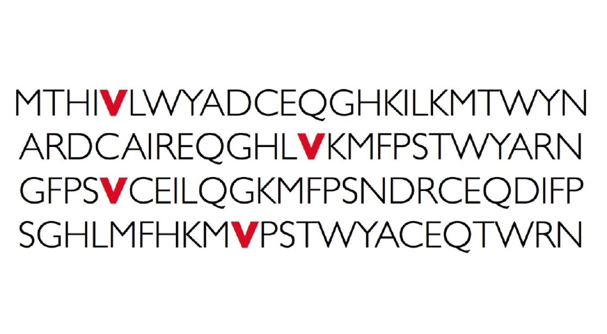
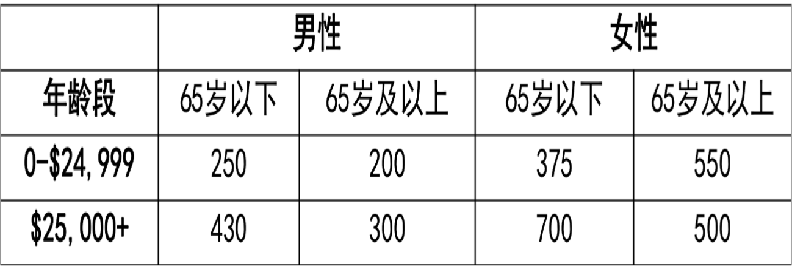
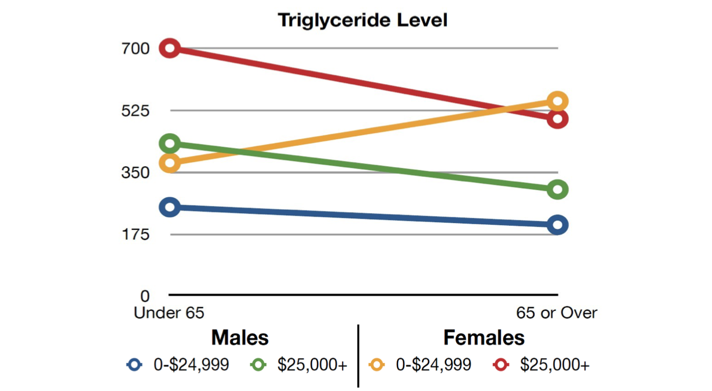
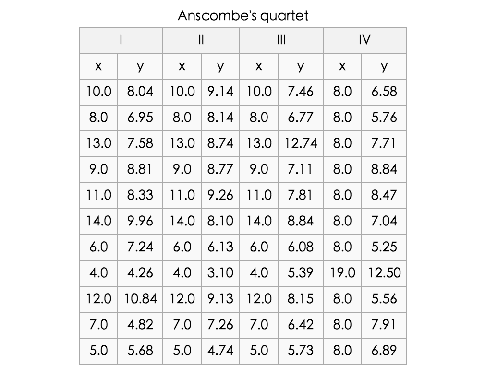
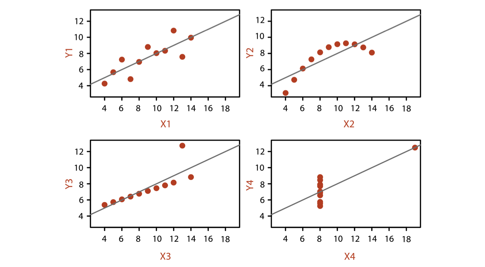

## 数据和视觉编码

Echarts团队

---

Note:
warm up.

----

----

Note: 哪个年龄段及收入水平人群的三酸甘油脂水平（身体脂肪量）趋势与其他均不同？

----

----

### {0|视觉感知}

> {0|客观事物通过人的视觉在人脑中形成的直接反映}

### {1|认知}

> {1|信息的获取、分析、归纳、解码、储存、概念形成、提取和使用}

### {2|**擅长**}

Note:
认知心理学将认知过程看成由信息的获取、分析、归纳、解码、储存、概念形成、提取和使用等一系列阶段组成的按一定程序进行的信息加工系统。

简单说，感知是关于输入信号的本质，也就是看见的事物；而认知是关于怎样理解和解释看到的东西。

接受到的信息大部分来源于视觉。视觉擅长进行认知。

----

Note:
再举个例子

----

---

# 数据

----

Note: 海量数据

----

Note: 如何转化为人脑可认知的视觉元素

----

### 类别

* {0|数值}

    * {0|10米 5mA 2048KB 312天}

* {1|有序}

    * {1|小，中，大}
    * {1|周一，周二，周三}

* {2|类别}

    * {2|北京，南京，开封}

* {3|维度}

    * {3|一维、二维、三维、n维}

* {4|关系}

    * {4|树、图（网络）}

Note:
可视化的设计、ec的制作中，考虑对数据从这些类别上来刻画。
映射、视觉元素

---

# 可视编码

* {0|标记（图形元素）}
* {1|视觉通道}

Note:

可视编码由两部分组成:标记 和 视觉通道（用于控制标记的视觉特征）

可视编码是信息可视化的核心，是将数据信息映射成可视化元素的技术。

----

## 标记

{0|
点
~[350*400](./asset/ec-demo/glyph-point.html)
}

{1|
线
~[350*400](./asset/ec-demo/glyph-line.html)
}

{2|
面
~[350*400](./asset/ec-demo/glyph-area.html)
}

Note: 这个大家都知道。

----

## 视觉通道

{0|颜色&nbsp;&nbsp;&nbsp;亮度&nbsp;&nbsp;&nbsp;饱和度&nbsp;&nbsp;&nbsp;透明度
}
{1|尺寸&nbsp;&nbsp;&nbsp;形状&nbsp;&nbsp;&nbsp;纹理&nbsp;&nbsp;&nbsp;方向}
{2|动画}

Note:

可能没有给予足够的意识

1.类型（type）
    是什么/在哪里（what/where）
    何种程度（how much）
2.表现力（expressiveness）
    表达且仅表达数据的完整属性
    判断标准：精确性、可辨性、可分离性、视觉突出
3.有效性（effectiveness）
    通道表现力符合属性的重要性

下面是一些视觉通道的解释

----

### 颜色

{0|类别型数据}

{1|~[700*500](./asset/ec-demo/color-category.html)}

----

#### 颜色 - 数值型数据

{0|~[1000*500](./asset/ec-demo/color-grey.html)}

----

#### 颜色 - 多种视觉通道

{0|~[1000*500](./asset/ec-demo/color-mix-aqi.html)}

----

### 形状

{0|~[1000*500](./asset/ec-demo/symbol.html)}

----

### 视觉突出

~[1000*500](./asset/ec-demo/symbol-categories.html)

Note:

形状为辅助，并不如颜色和大小。

----

### 色彩设计原则

* 避免过多颜色交错导致的杂乱无章
* 使用中性背景色，控制对全局色彩的影响
* 最小化同时对比

---

### 可视化设计原则

* {0|任务}

{0|总览（overview）、缩放（zoom）、过滤（filter）、details-on-demand、相关（relate）、历史（history）}

* {1|可视化箴言}

{1|总览为先，缩放过滤，按需查看细节（Overview first，zoom and filter，details on demand）}

----

~[1000*500](./asset/ec-demo/principle-dataZoom.html)

---

# 各种数据的可视化

----

### 点数据的可视化

~[1000*500](./asset/ec-demo/data-weibo.html)

Note:

描述地理空间中离散的点，具有经度和纬度的坐标，但不具备大小和尺寸，
包括地图上的地标、附件的美食等

最直接的可视化点数据的方法
根据坐标直接标识在地图上，圆点是最常用的标识符号，其他标识符号还有向量箭头

----

#### 线数据的可视化

{0|~[1200*600](./asset/ec-demo/global-airline.html)}

Note:
线数据通常指连接两个或多个地点的线段或路径，线数据具有长度属性，即经过的地理距离

----

### 向量

{0|}

{1|}

Note:

NASA Perpetual Ocean

----

~[1200*650](./asset/ec-demo/global-wave.html)

----

### 区域数据的可视化

~[1000*500](./asset/ec-demo/data-map.html)

----

~[1000*500](./asset/ec-demo/data-line-area.html)

----

### 时间数据的可视化

~[1000*500](./asset/ec-demo/data-k.html)

----

~[1000*500](./asset/ec-demo/data-timeline.html)

----

### 关系数据

{0|树}

{1|图}

----

#### 层级数据的可视化

{0|~[1000*600](./asset/ec-demo/hierarchy-tree.html)}

----

~[1400*650](./asset/ec-demo/hierarchy-obama.html)

Note:
visual mapping

----

~[1000*500](./asset/ec-demo/data-disk.html)

----

### 网络数据的可视化

~[1000*500](./asset/ec-demo/data-graph.html)

Note:

chrod -- graph

----

~[1000*500](./asset/ec-demo/data-force.html)

----

### 高维数据

~[1000*500](./asset/ec-demo/color-mix.html)

Note:

比较，首先用前面的color-mix:
在二维/三维图表上增加视觉通道，以表达更多的属性信息。
但是 ...

----

### 高维数据 - 协同分析

~[1000*500](./asset/ec-demo/data-coop-scatter.html)

----

### 高维数据 - 散点图矩阵

~[1000*500](./asset/ec-demo/data-coop-scatter.html)

Note:
来不及的话，就用图片吧

---

# 谢谢
